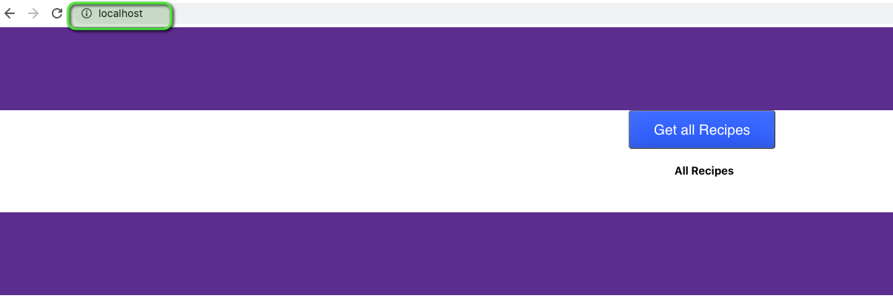
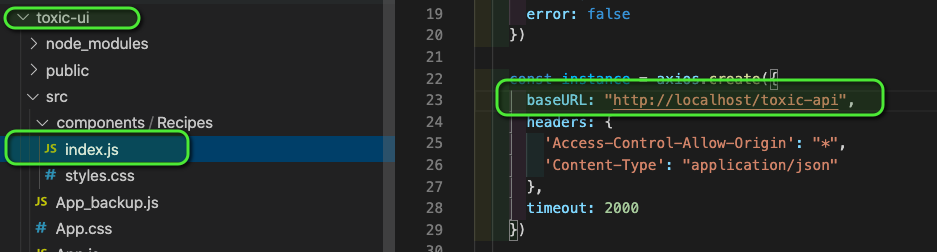
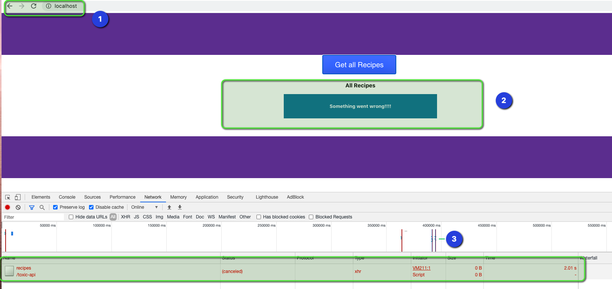

# toxiproxy-test
An end to end containerised test of using toxiproxy for chaos engineering tests. The purpose of this repository is to test shopifys toxiproxy as a sidecar to our applications and inject failure to identify resiliency bottlenecks.


---
## What does this repo include?
This repository is a bundle comprised of:
- Reverse Proxy built with nginx
- Frontend UI - with React
- Python FastAPI
- ToxiProxy

All of the above have been setup to auto-compile when running `docker-compose build` or `docker compose up`

---

## How to run this project?
- Go to the root folder where the `docker-compose.yaml` file recides.
- Run `docker-compose build`
- Run `docker-compose up`
---
## How is the API exposed to the UI?

The API is exposing a single endpoint `/recipes` which is consumed by the React UI app. This is configured in `/toxic-ui/src/components/recipes/index.js` on line 23. You can swap this URL to be `/api` while calling the API directly from the UI and `/toxic-api` when the API call needs to be made via the `toxi-proxy` latency toxic.

---
## How to create toxics and/or add toxicity?
The toxyproxy is currently not configured to automatically configure the proxy and the toxic behaviour. You need to exec into the container once it is up and running after using the `docker-compose up` command and run the below commands to enable the toxiproxy. 
```bash
cd /go/toxiproxy
./toxiproxy-cli create httpproxy -listen 0.0.0.0:8000 --upstream api:8000
./toxiproxy-cli toxic add httpproxy -type latency --attribute latency=5000
./toxiproxy-cli list
```
Once this is done, you can change the Axios API call in the UI configured in `/toxic-ui/src/components/recipes/index.js` on line 23 to use the `/toxic-api` path instead of the direct `/api` path

---
## How to test the application?
The application has been setup to use Axios to make the get request to the API. The Axios initialisation has a timeout of 3 seconds configured. The intent of this project is to remove the timeout from this call to demonstrate how latencies can be left undetected and found using the toxic behaviour and then adding the timeouts back to explain how our Engineering teams should be developing with failure in mind at all times.

---
## Examples of working application with and without the proxy
**Working UI** which can be accessed on `localhost` using port `80` 

The below image shows how our UI has been configured to directly call the API to simulate a realworld scenario.


When invoked from the browser, below image shows call without toxic behaviour.


Now we will docker exec into the toxi-proxy container and enable the proxy and add the toxic behaviour, following which we will change the UI to now point to the toxic proxy.


The below image shows how our UI has now been **updated** to call the API via the proxy path to simulate a realworld scenario.


Now lets make the UI call again 🚧


Now let us add a circuit breaker timeout of 2 seconds to the UI as shown below (in the component index.js file):
```javascript
const instance = axios.create({
      baseURL: "http://localhost/toxic-api",
      headers: { 
        'Access-Control-Allow-Origin': "*",
        'Content-Type': "application/json"
      },
      timeout: 2000
    })
```
Make a UI call to see if the circuit breaker worked.


## Conclusion
This is how we can make use of toxiproxy to inject different failures into our applications without having to make many changes to our application and simply adding the toxic behaviour as sidecar to the pod/container environment.

Thankyou!